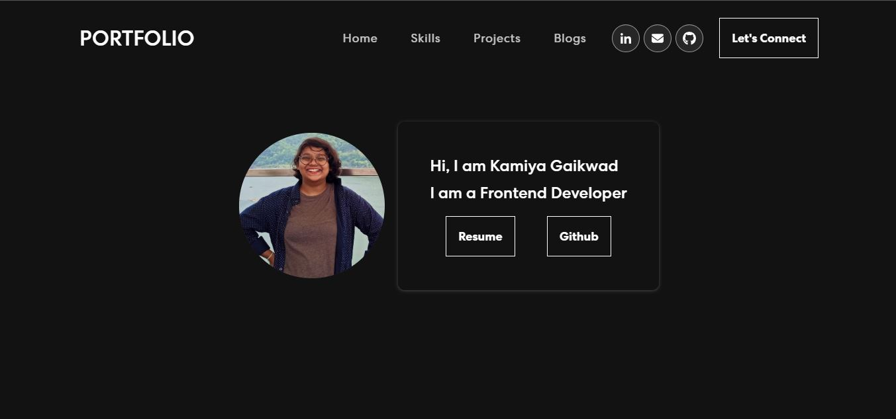

# Kamiya's Portfolio

## Overview

Welcome to my personal portfolio repository! This repository contains the source code and assets for my online portfolio showcasing my skills, projects, and more.

## Live Demo

Check out the live version of my portfolio [here](https://kamiya-gaikwad-portfolio.vercel.app/).

## Table of Contents

- [Features](#features)
- [Technologies Used](#technologies-used)
- [Getting Started](#getting-started)
- [Project Structure](#project-structure)
- [Deployment](#deployment)

## Features

- **Resume:** Downloadable resume.
- **Skills:** List of skills and technologies.
- **Projects:** Showcase of projects with descriptions and links.
- **Blogs:** List of my technical blogs.
- **Contact:** Ways to get in touch.

## Technologies Used

- HTML5
- CSS3
- JavaScript
- React
- Bootstrap
- NodeJs
- React Bootstrap

## Getting Started

To run this React project locally, follow these steps:

1. Clone the repository: `git clone https://github.com/KamiyaGaikwad/personal-portfolio.git`
2. Navigate to the project directory: `cd personal-portfolio`
3. Install dependencies: `npm install`
4. Start the development server: `npm start`
5. Open your browser and visit [http://localhost:3000](http://localhost:3000)

The project will automatically open in your default web browser, and any changes you make to the source code will trigger hot-reloading, allowing you to see the changes instantly.

To stop the development server, you can use `Ctrl + C` in the terminal.

## Project Structure

├── public
│   ├── index.html
│   └── [other public assets]
├── src
│   ├── components
│   │   ├── Home.js
│   │   ├── About.js
│   │   ├── Projects.js
│   │   ├── HashnodeBlog.js
│   │   └── [additional components]
│   ├── assets
│   │   ├── img
│   │   │   └── [image files]
│   │   ├── resume.pdf
│   │   └── [additional assets]
│   ├── App.css
│   ├── App.js
│   ├── index.js
│   └── [other React-specific files]
├── .gitignore
├── package.json
└── README.md

## Deployment

This portfolio is deployed using [Vercel](https://vercel.com/). Any changes pushed to the `main` branch are automatically deployed.

